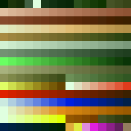
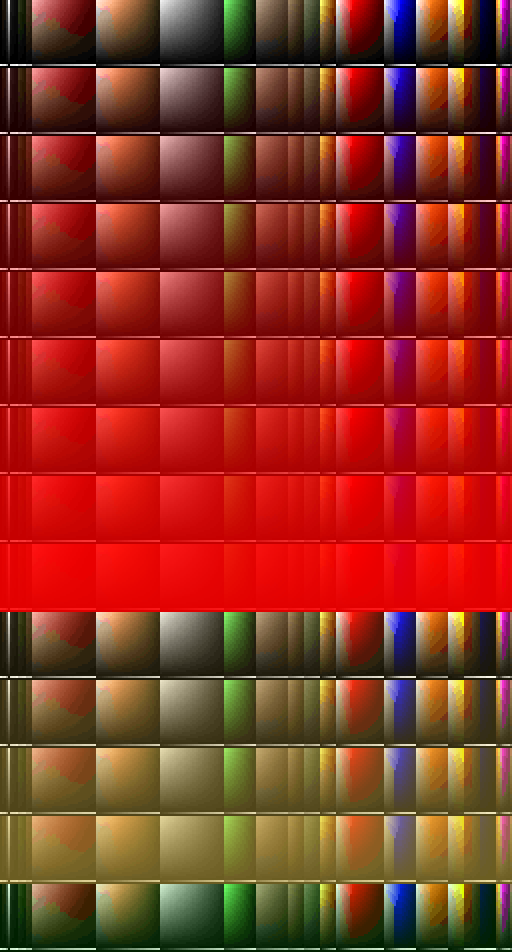

# DOOM From Scratch!

1. WAD File Parsing
    1. [WAD File Format and Data Types](#wad-file-format-and-data-types)
    2. [Loading the WAD File](#loading-the-wad-file)
    3. [Reader Functions for WAD Files](#reader-functions-for-wad-files)
    4. [Reading the Header](#reading-the-header)
    5. [Reading the Directory](#reading-the-directory)
    6. [Reading Palettes](#reading-palettes)
    7. [Reading Colormaps](#reading-colormaps)
2. References

## WAD File Parsing

WAD files are the bread and butter of DOOM. They contain all the in-game data for the game. Yes, ALL the in-game data. WAD stands for Where's All the Data? [3] so a single file contains all the assets of the game. Being able to read and parse them is crucial for creating DOOM from scratch. This is why, the first chapter of this project is devoted to properly parsing and interpreting all the content from WAD files. To that end, we have defined a `WAD` class in `include/wad.hpp` which will be responsible for holding (in an structured manner) all the data from the WAD file and also provide methods to load and parse such files. Everything that we mention in this chapter will be implemented on that class unless otherwise specified.

### WAD File Format and Data Types

DOOM WADs are binary files that are stored in Big Endian order, i.e., the most significant bytes are stored before lesser significant ones. In other words, the most significant byte is stored at the lowest memory address. This is important because modern computers do not use this kind of endianness but rather use Little Endian. This means that we must be careful when reading multibyte data from the WAD file so we need to reverse the byte order of each variable.

The DOOM WADs may contain only five different datatypes [1] which are summarized in the following table.

| Type | Bytes | Range |
|---|---|---|
| Unsigned Integer | 4 | [0, 4294967295]|
| Signed Integer | 4 | [-2147483648, 2147483647]|
| Unsigned Short | 2 | [0, 65535]|
| Signed Short | 2 | [-32768, 32767]|
| ASCII Character | 1 | [0, 255] |

### Loading the WAD File

The routine our WAD class constructor will invoke is the WAD loading one `void load_wad()`. This procedure will open an specified WAD file to be read in binary mode. The whole file will be read and stored in a class member `std::unique_ptr<uint8_t[]> m_wad_data`, i.e., a unique pointer to an array of bytes. Two design decisions were taken here: (1) we decided to use the `uint8_t` type, contained in the `cstdint` header due to its portability and implementation independence, and (2) we are using smart `std::unique_ptr` pointers to hold WAD data to make this data handling process less error prone providing that we will have an unique owner for the WAD data (the WAD class itself). We will use a class member `unsigned int m_offset` to specify the current byte offset to the file and keep track of it.

```c++
void load_wad(const std::string & filename)
{
	std::cout << "Reading WAD " << filename << "\n";
	std::ifstream wad_file_(filename, std::ios::binary | std::ios::ate);

	if (!wad_file_)
		throw std::runtime_error("Could not open file " + filename);

	std::streamsize wad_size_ = wad_file_.tellg();
	std::cout << "WAD file size is " << wad_size_ << "\n";

	m_wad_data = std::make_unique<uint8_t[]>((unsigned int)wad_size_);

	wad_file_.seekg(0, std::ios::beg);
	wad_file_.read((char*)m_wad_data.get(), wad_size_);
	wad_file_.close();

	std::cout << "WAD read successfully!\n";

	m_offset = 0;
}
```

### Reader Functions for WAD Files

We need five basic functions to read all the data types from the WAD files. These functions will get the appropriate bytes from the WAD file data (the `uint8_t` array) and then change their order to generate a little endian representation. The following functions are the originally ones coded by movax13h [1] but adapted to use the modern C++ pointers `std::unique:ptr<uint8_t[]>` instead of just plain pointers `uint8_t *`.

Shorts are read using the `short read_short()` and `unsigned short read_ushort()` functions. Both of them apply the same logic: they get two consecutive bytes from the WAD data pointer at the specified location, e.g., `0xAABB` in Big Endian, and then shift the bytes to generate a `0xBBAA` Little Endian representation for the short which is returned by the function.

```c++
short read_short(const std::unique_ptr<uint8_t[]> & rpData, unsigned int offset)
{
	short tmp_ = (rpData[offset + 1] << 8) | rpData[offset];
	return tmp_;
}

unsigned short read_ushort(const std::unique_ptr<uint8_t[]> rpData, unsigned int offset)
{
	unsigned short tmp_ = (rpData[offset + 1] << 8) | rpData[offset];
	return tmp_;
}
```

The same logic but extended to four bytes instead of two is applied by the integer reading functions `int read_int()` and `unsigned int read_uint()`:

```c++
int read_int(const std::unique_ptr<uint8_t[]> & rpData, unsigned int offset)
{
	int tmp_ = (rpData[offset + 3] << 24) |
		(rpData[offset + 2] << 16)	|
		(rpData[offset + 1] << 8) |
		rpData[offset];

	return tmp_;
}

unsigned int read_uint(const std::unique_ptr<uint8_t[]> & rpData, unsigned int offset)
{
	unsigned int tmp_ = (rpData[offset + 3] << 24) |
		(rpData[offset + 2] << 16) |
		(rpData[offset + 1] << 8) |
		rpData[offset];

	return tmp_;
}
```

The last helper function to read data from the WAD data pointer is the one to read non-null-terminated strings of ASCII characters. This `void copy_and_capitalize_buffer()` function reads bytes from the data pointer one by one, capitalizes each single byte character, and appends it to the provided reference to an `std::string` (which is previously emptied). Since the ASCII strings are not terminated by a null character, we must provide the number of characters we need to read to the function and it will stop at that point or if the data pointer comes to an end.

```c++
void copy_and_capitalize_buffer(
	std::string & rDst,
	const std::unique_ptr<uint8_t[]> & rpSrc,
	unsigned int offset,
	unsigned int srcLength)
{
	rDst = "";

	for (unsigned int i = 0; i < srcLength && rpSrc[offset + i] != 0; ++i)
		rDst += toupper(rpSrc[offset + i]);
}

```

All those methods are implemented in the `include/readers.hpp` header. Using those methods, we will be able to parse the whole WAD file and extract its contents.

### Reading the Header

The WAD header is the first thing that appears at the beginning of a WAD file. It consist of a sequence of 12 bytes divided into three 4-byte parts. Such parts are the following ones:

- (4 bytes) a not null-terminated ASCII string which indicates the type of the WAD file: either "IWAD" or "PWAD". The first one is an original file while the latter is a patched WAD file.
- (4 bytes) an unsigned integer that specifies the number of directory ENTRIES (total number of LUMPS) contained in the file.
- (4 bytes) an unsigned integer which holds the exact byte offset from the beginning of the WAD file where the DIRECTORY begins.

To store the WAD header, we declared a `struct`, namely `WADHeader`:

```c++
struct WADHeader
{
	std::string type;
	unsigned int lump_count;
	unsigned int directory_offset;
};

```

Then we added a member to our WAD class `WADHeader m_wad_header;` which we can fill with the header information coming from our WAD file thanks to the `read_header()` method. This procedure reads a 4-byte ASCII string into `m_wad_header.type`, a 4-byte unsigned integer into `m_wad_header.lump_count`, and another 4-byte unsigned integer into `m_wad_header.directory_offset`. 

```c++
#define WAD_HEADER_TYPE_LENGTH 4
#define WAD_HEADER_LUMPCOUNT_LENGTH 4
#define WAD_HEADER_OFFSET_LENGTH 4

[...]

void read_header()
{
	assert(m_wad_data);

	copy_and_capitalize_buffer(m_wad_header.type, m_wad_data, m_offset, WAD_HEADER_TYPE_LENGTH);
	m_offset += WAD_HEADER_TYPE_LENGTH;

	m_wad_header.lump_count = read_uint(m_wad_data, m_offset);
	m_offset += WAD_HEADER_LUMPCOUNT_LENGTH;

	m_wad_header.directory_offset = read_uint(m_wad_data, m_offset);
	m_offset += WAD_HEADER_OFFSET_LENGTH;
}
```

After reading the sample `doom1.wad` file, we can print the following header information:

```
WAD file
Type: IWAD
Lump Count: 1264
Directory Offset: 4175796
```

### Reading the Directory

The LUMP DIRECTORY starts at the byte offset specified in the header. The DIRECTORY has a 16 bytes ENTRY for each LUMP and it extends until the end of the file. Each ENTRY consists of three parts:

- (4 bytes) An unsigned integer which indicates the file offset to the start of the LUMP.
- (4 bytes) Another unsigned integer that tells the size (in bytes) of the LUMP.
- (8 bytes) An eight ASCII characters string which is the name of the LUMP padded with zeros.

To store each WAD ENTRY we created the following `struct` named `WADEntry` with those three fields:

```c++
struct WADEntry
{
	unsigned int offset;
	unsigned int size;
	std::string name;
};
```

Reading the directory is fairly easy. We preallocated `m_wad_header.lump_count` positions into another class member `std::vector<WADEntry> m_directory` to hold the directory. We also created a dictionary `std::map<std::string, int> m_lump_map` to map LUMP names to DIRECTORY positions so that we can look up LUMPs easily by name. Once that is done, directory reading is performed by `void read_directory()` which reads 16 bytes at a time until all LUMP ENTRIES have been read. Each newly generated ENTRY is stored in the DIRECTORY vector and also added to the dictionary with its LUMP name and its corresponding position in the DIRECTORY vector.

```c++
void read_directory()
{
  assert(m_wad_data);
  assert(m_wad_header.lump_count != 0);

  m_offset = m_wad_header.directory_offset;
  for (unsigned int i = 0; i < m_wad_header.lump_count; ++i)
  {
    WADEntry entry_;
    entry_.offset = read_uint(m_wad_data, m_offset);
    m_offset += WAD_ENTRY_OFFSET_LENGTH;
    entry_.size = read_uint(m_wad_data, m_offset);
    m_offset += WAD_ENTRY_SIZE_LENGTH;
    copy_and_capitalize_buffer(entry_.name, m_wad_data, m_offset, 8);
    m_offset += WAD_ENTRY_NAME_LENGTH;

    m_directory.push_back(entry_);
    m_lump_map.insert(std::pair<std::string, unsigned int>(entry_.name, i));
  }
}
```

### Reading Paletes

Palettes are stored in the PLAYPAL LUMP. Such LUMP consists of fourteen 256-color palette. Since each RGB triplet takes three bytes (one for each channel which can be in the range [0, 255]), each palette takes 768 bytes in the LUMP. This means that the PLAYPAL LUMP takes 10752 bytes in total. For more information see [2] chapter 8-1.

Palettes will be stored in the class member `std::vector<std::vector<WADPaletteColor>> m_palettes`. Each one of them is represented as a vector of `WADPaletteColor`, which is a `struct` that contains three fields representing an RGB triplet:

```c++
struct WADPaletteColor
{
	uint8_t r;
	uint8_t g;
	uint8_t b;
};
```

To read the palettes, we can just look for the PLAYPAL LUMP in our map and then get the corresponding byte offset to its start from the DICTIONARY. Then we will read chunks of 256 RGB colors (three bytes each one) and create a new palette for each chunk that will be stored in our palette vector. We will keep reading until we get to the end of the LUMP using our common byte offset (this decision was taken in order not to hardcode the number of palettes to 14 so that if any patch is applied we can read as many palettes as we want). The palette reading routine is `void read_palettes()`.

```c++
void read_palettes()
{
  assert(m_wad_data);
  assert(m_lump_map.find("PLAYPAL") != m_lump_map.end());

  WADEntry palettes_ = m_directory[m_lump_map["PLAYPAL"]];

  m_offset = palettes_.offset;
  while (m_offset < palettes_.offset + palettes_.size)
  {
    std::vector<WADPaletteColor> palette_(256);

    for (unsigned int i = 0; i < 256; ++i)
    {
      WADPaletteColor color_;
      color_.r = m_wad_data[m_offset++];
      color_.g = m_wad_data[m_offset++];
      color_.b = m_wad_data[m_offset++];
      palette_[i] = color_;
    }

    m_palettes.push_back(palette_);
  }
}
```

We also coded a brief procedure, namely `void write_palettes()`, which takes each palette in the palette vector and produces a PPM image for each one of them so that we can visualize them. Since palettes are written as small `16 x 16` images, we also scaled them to 1600% the original size and converted them to PNG using `mogrify -scale 1600% palette*` and `mogrify -format png *.ppm` respectively. The resulting palettes are shown below:

|   |   |   |   |
|---|---|---|---|
|||||
|||||
|||||
||| | |

### Reading Colormaps

The COLORMAP LUMP contains 34 color maps that map colors from palettes down in brightness. Each one of them is 256 bytes long so that each byte indexes pixels whithin a palette, i.e., the second byte of the first color map applied to the third palette indicates which pixel within that palette corresponds to the second position of the very same palette. Color maps were mainly used in DOOM for sector brightness (being color map 0 the brightest one and 31 the darkest). See [4] for a more detailed explanation of how color maps work.

Color maps will be stored in our WAD class in the `std::vector<std::vector<uint8_t>> m_colormaps` member. Each color map is represented as a vector of `uint8_t` since we are dealing with just pixel indices. To read the color maps, we just look for the COLORMAP LUMP in our map and then get the corresponding offset to the its start from the DICTIONARY. Then we read chunks of 256 bytes and create a new color map for each one of them. Those color maps are inserted in the aforementioned class member which was previously preallocated to 34 items. The color map reading routine is `void read_colormaps()`.

```c++
void read_colormaps()
{
  assert(m_wad_data);
  assert(m_lump_map.find("COLORMAP") != m_lump_map.end());

  WADEntry colormaps_ = m_directory[m_lump_map["COLORMAP"]];

  m_offset = colormaps_.offset;
  while (m_offset < colormaps_.offset + colormaps_.size)
  {
    std::vector<uint8_t> colormap_(256);

    for (unsigned int i = 0; i < 256; ++i)
      colormap_[i] = m_wad_data[m_offset++];

    m_colormaps.push_back(colormap_);
  }
}
```

We also coded a brief procedure, namely `void write_colormaps()`, which applies all the colormaps to each palette and produces a PPM image that combines all of them. Each row is a palette after applying a color map. For instance, the first 34 rows represent the 34 color maps applied to the first palette. We also scaled the output to 200% the original size and converted it to PNG using `mogrify -scale 200% colormaps.ppm` and `convert colormaps.ppm colormaps.png` respectively. The resulting image is shown below:



## References

- [1] [movax13h - Building a DOOM Engine from scratch with C/C++ and OpenGL – The WAD File – 001](http://www.movax13h.com/devlog/building-a-doom-engine-from-scratch-with-c-c-and-opengl-the-wad-file-001/)
- [2] [The Unofficial DOOM](http://www.gamers.org/dhs/helpdocs/dmsp1666.html)
- [3] [Doom Wiki WAD](https://doom.fandom.com/wiki/WAD)
- [4] [Writing a Doom-style shader for Unity](https://medium.com/@jmickle_/writing-a-doom-style-shader-for-unity-63fa13678634)